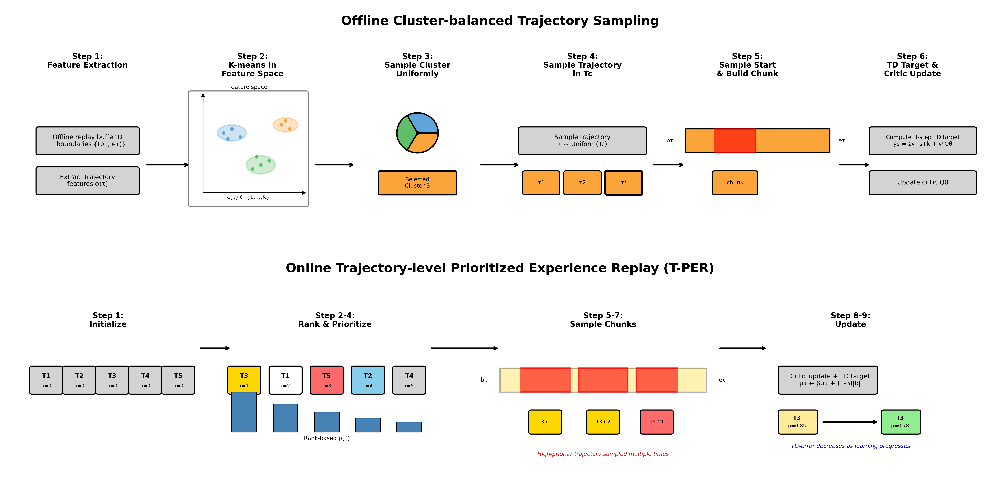
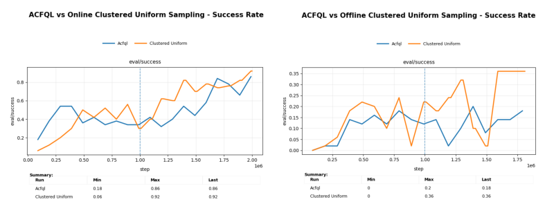
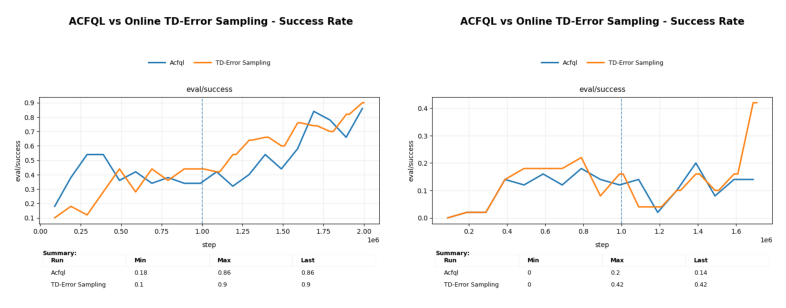
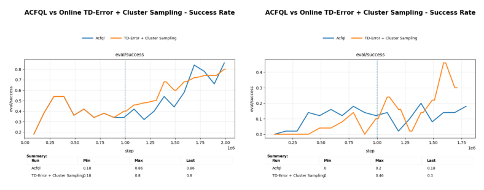

<div align="center">

# Trajectory-level Priority Sampling for Off-to-On RL

</div>

<table>
  <tr>
    <td width="48%" valign="top">
      
    </td>
    <td width="48%" valign="top">
      
      <br>
      
      <br>
      
    </td>
  </tr>
</table>


## Overview
This work introduces trajectory-level priority sampling methods for stable offline-to-online reinforcement learning:

- **Offline Cluster-balanced Trajectory Sampling**: Ensures diverse trajectory coverage during offline training by clustering trajectories in feature space and sampling uniformly across clusters
- **Online Trajectory-level Prioritized Experience Replay (T-PER)**: Prioritizes high-TD-error trajectories during online fine-tuning to focus learning on difficult transitions

These methods improve sample efficiency and training stability in sparse reward robotic manipulation tasks.

## Code Base
This implementation is built on top of [Action Chunking with Flow Q-Learning (ACFQL)](https://github.com/seohongpark/qc), extending it with trajectory-level sampling strategies.

## Installation
```bash
# Create conda environment
conda create -n tper python=3.10
conda activate tper

# Install dependencies
pip install -r requirements.txt
```

## Datasets
For robomimic environments, datasets should be located at:
- `~/.robomimic/lift/mh/low_dim_v15.hdf5`
- `~/.robomimic/can/mh/low_dim_v15.hdf5`
- `~/.robomimic/square/mh/low_dim_v15.hdf5`

Download from: https://robomimic.github.io/docs/datasets/robomimic_v0.1.html (Method 2: Direct Download Links - Multi-Human (MH))

For cube-quadruple, use the 100M-size offline dataset:
```bash
wget -r -np -nH --cut-dirs=2 -A "*.npz" https://rail.eecs.berkeley.edu/datasets/ogbench/cube-quadruple-play-100m-v0/
```
Add flag: `--ogbench_dataset_dir=[realpath/to/your/cube-quadruple-play-100m-v0/]`

For sparse reward environments (`scene` and `puzzle-3x3`), use `--sparse=True`.

## Running Experiments

### Basic Usage
```bash
# Baseline: ACFQL
MUJOCO_GL=egl python main_acfql.py \
  --run_group=baseline \
  --env_name=square-mh-low \
  --sparse=False \
  --horizon_length=5 \
  --offline_steps=1000000 \
  --online_steps=1000000
  --entity=P{YOUR_WANDB_ENTITY} \

# With Cluster-balanced Sampling (Offline)
MUJOCO_GL=egl python main.py \
  --env_name=square-mh-low \
  --run_group=cluster_balanced \
  --use_ptr_backward=True \
  --use_ptr_online_priority=True \
  --sparse=False \
  --agent.alpha=100 \
  --horizon_length=5 \
  --metric=uniform \
  --cluster_sampler=True \
  --entity=P{YOUR_WANDB_ENTITY} \

# With T-PER (Online Priority Sampling)
MUJOCO_GL=egl python main.py \
  --env_name=square-mh-low \
  --run_group=tper \
  --use_ptr_backward=True \
  --use_ptr_online_priority=True \
  --sparse=False \
  --agent.alpha=100 \
  --horizon_length=5 \
  --metric=td_error_rank \
  --cluster_sampler=False \
  --entity=P{YOUR_WANDB_ENTITY} \

# Full Method: Cluster-balanced + T-PER
MUJOCO_GL=egl python main.py \
  --env_name=square-mh-low \
  --run_group=tper \
  --use_ptr_backward=True \
  --use_ptr_online_priority=True \
  --sparse=False \
  --agent.alpha=100 \
  --horizon_length=5 \
  --metric=td_error_rank \
  --cluster_sampler=True \
  --entity=P{YOUR_WANDB_ENTITY} \

```

### Key Hyperparameters

**Cluster-balanced Sampling:**
- `--cluster_sampler`: Enable cluster-balanced trajectory sampling during offline training

**T-PER (Trajectory-level Priority Sampling):**
- `--use_ptr_backward`: Enable backward sampling from trajectory endpoints
- `--use_ptr_online_priority`: Enable online priority updates based on TD-error
- `--metric`: Priority metric (`td_error_rank`, `success_binary`, `avg_reward`)
- `--ptr_warmup_steps`: Steps before enabling priority sampling (default: 20000)
- `--backward`: Sample from end of trajectories (not recommended on ACFQL baseline)

**SARSA-style Weighted Target (not recommended):**
- `--use_weighted_target`: Enable weighted combination of policy and trajectory targets
- `--beta`: Weight for policy target (default: 0.5)

## Project Structure

```
.
├── main.py                      # Main training script
├── agents/
│   └── acfql.py                 # ACFQL agent with priority sampling
├── utils/
│   └── datasets.py      # Dataset and PriorityTrajectorySampler
├── cluster_vis.py               # Trajectory clustering utilities
└── assets/
    └── algorithm_visualizations_final.png
```

## Key Components

### PriorityTrajectorySampler
Located in `utils/datasets.py`, handles:
- Trajectory boundary tracking
- Priority computation (reward-based, success-based, TD-error-based)
- Rank-based sampling for stability
- Online priority updates

### ClusterBalancedSampler
Located in `train.py`, provides:
- K-means clustering in trajectory feature space
- Uniform sampling across clusters
- Automatic K selection based on return homogeneity

## Monitoring Training

The code logs to Weights & Biases with the following key metrics:

**Offline Phase:**
- `offline_agent/critic_loss`: Critic training loss
- `offline_agent/actor_loss`: Actor training loss
- `cluster/offline/*`: Cluster sampling statistics

**Online Phase:**
- `online_agent/q_mean`: Average Q-values
- `online_agent/td_error_mean`: TD-error statistics
- `ptr/sample_online/*`: Priority sampling statistics
- `eval/success_rate`: Task success rate

## Citation

If you use this code or find it helpful, please consider citing:

```
@article{yourname2025tper,
  author = {Your Name},
  title  = {Trajectory-level Priority Sampling for Stable Offline-to-Online RL},
  year = {2025},
}
```

## Acknowledgments

This codebase builds upon:
- [Action Chunking with Flow Q-Learning (ACFQL)](https://github.com/ColinQiyangLi/qc)
- [Flow Q-Learning (FQL)](https://github.com/seohongpark/fql)
- [RLPD](https://github.com/ikostrikov/rlpd)
